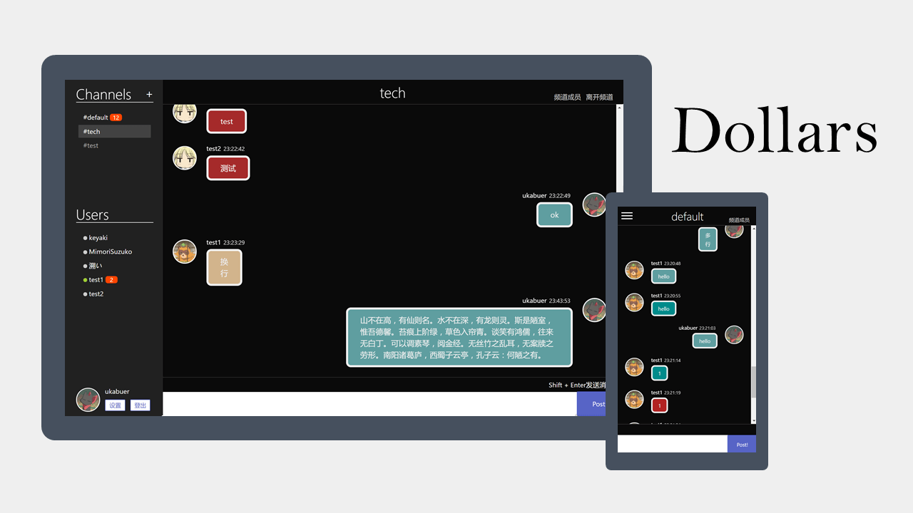

# Dollars
A chatroom using [Socket.IO](https://socket.io).

[Live Demo](https://dollars.arukascloud.io)



## Deploy
Make sure you have `Nodejs` installed

Download the newest release at [here](https://github.com/ukabuer/dollars/releases/latest)

Install dependencies
```
npm install --only=production
```

Run the server
```
npm start
```

Visit `http://localhost:3000` and you will see the welcome page

### Deploy with Docker
Just build you own or you can check out [ukabuer/dollars](https://hub.docker.com/r/ukabuer/dollars/)

## Contribute
Make sure you have `Nodejs` & `Git` installed

Fetch all the files
```
git clone https://github.com/ukabuer/dollars.git
```

Install all dependencies
```
npm install
```

Build target js file
```
npm run build-win
or
npm run build-unix
```

Run the server
```
npm start
```

Visit `http://localhost:3000` and you will see the welcome page

## Todo
- [ ] Support emoji
- [ ] Support uploading images
- [ ] Private channel
- [ ] Mobile device support
- [ ] PWA